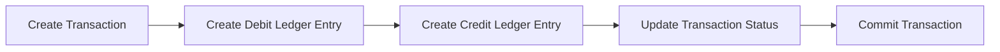
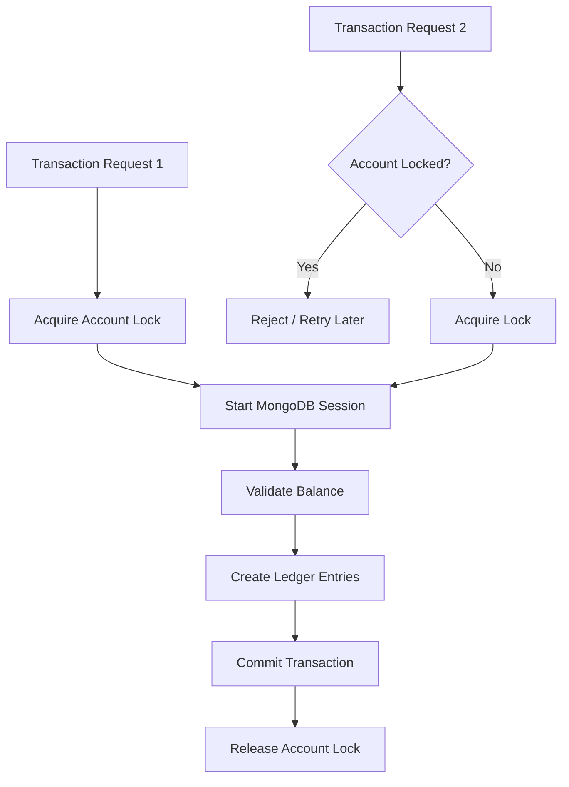

# 🏦 Bank Transaction System Backend

A secure and scalable banking backend system built using **Node.js, Express.js, and MongoDB**.  
The application provides core banking operations including user authentication, account management, deposits, withdrawals, fund transfers, transaction history, and account statements.

The project focuses on backend engineering concepts such as **JWT authentication, RESTful API design, database transactions, idempotency handling, ledger-based accounting, and concurrency control** to maintain data consistency during financial operations.

---
## 📚 Table of Contents

- 🚀 Features
- 🏗️ Project Architecture
- 🛠️ Tech Stack
- 🗄️ Database Design
- 🔌 API Endpoints
- ▶️ Running the Project Locally
- 🧪 Testing
- 🔮 Future Improvements
- 👨‍💻 Author


# 🚀 Features

## 🔐 Authentication & Authorization

- User registration and login using JWT authentication
- Password encryption using hashing techniques
- Protected routes using authentication middleware
- Role-based access control for secured operations


## 👤 Account Management

- Create and manage user accounts
- Maintain account status (ACTIVE/INACTIVE)
- Secure access to user-owned accounts


## 💰 Transaction Processing

Supports three major banking operations:

### 1. Fund Transfer

- Transfer money between accounts
- Validate sender and receiver accounts
- Check account status
- Verify sufficient balance
- Create debit and credit ledger entries
- Maintain transaction records


### 2. Deposit

- Add funds to an account
- Create credit ledger entries
- Maintain transaction history


### 3. Withdrawal

- Withdraw money from an account
- Validate available balance
- Create debit ledger entries
- Prevent negative balances


---

## 🧾 Ledger-Based Accounting

The system follows a ledger-based transaction model instead of directly updating account balances.

Every financial operation creates ledger entries:

### Debit Entry

Represents money leaving an account.

Example:


Account A

Debit ₹100

### Credit Entry

Represents money entering an account.

Example:


Account B

Credit ₹100

The current account balance is derived from ledger entries.

Formula:


Balance = Total Credits - Total Debits


This approach provides better transaction traceability and audit capability.

---

## ⚡ Concurrency Handling & Data Consistency

Financial systems require strong consistency to prevent incorrect balances.

This project handles concurrent transactions using:

## MongoDB Transactions

Used MongoDB sessions to ensure multiple database operations succeed or fail together.

Example:





If any step fails:


Rollback all changes


---

## Account-Level Locking

Implemented account locking to prevent multiple simultaneous transactions from modifying the same account.

Example:





This prevents race conditions.

---

## Optimistic Concurrency Control

Implemented version-based concurrency checks to detect conflicting updates.

Example:


Account Version = 5

Transaction A updates:
Version 5 → 6 ✅

Transaction B tries:
Version 5 → 6 ❌

Conflict detected


---

## 🔁 Idempotency Handling

Financial APIs should not process the same transaction multiple times.

Each transaction request requires a unique:


idempotencyKey


Example:

```json
{
  "amount":1000,
  "idempotencyKey":"transfer_12345"
}
```

If the same request is sent again:

Existing transaction found

No duplicate processing

This prevents duplicate money transfers.

---

##📄 Account Statements

Users can view complete transaction history including:

Transaction date
Transaction type
Debit/Credit details
Transaction status
Running balance

Example:

### 📄 Sample Account Statement

| Date | Transaction Type | Amount | Running Balance |
|------|------------------|--------:|----------------:|
| 01/07/2026 | Deposit | +₹5,000 | ₹5,000 |
| 02/07/2026 | Transfer | -₹1,000 | ₹4,000 |
| 03/07/2026 | Deposit | +₹2,000 | ₹6,000 |

## 🏗️ Project Architecture

```text
Bank-Backend
│
├── src
│   ├── controllers
│   │   ├── auth.controller.js
│   │   ├── account.controller.js
│   │   └── transaction.controller.js
│   │
│   ├── models
│   │   ├── user.model.js
│   │   ├── account.model.js
│   │   ├── transaction.model.js
│   │   └── ledger.model.js
│   │
│   ├── routes
│   │   ├── auth.routes.js
│   │   ├── account.routes.js
│   │   └── transaction.routes.js
│   │
│   ├── middleware
│   │   └── auth.middleware.js
│   │
│   ├── services
│   │   └── email.service.js
│   │
│   ├── config
│   │   └── db.js
│   │
│   └── app.js
│
├── server.js
├── package.json
└── README.md
```

## 🛠️ Tech Stack

| Category | Technologies |
|----------|--------------|
| **Backend** | Node.js, Express.js |
| **Database** | MongoDB, Mongoose ODM |
| **Authentication** | JWT, Middleware-based Authorization |
| **API Testing** | Postman |
| **Version Control** | Git, GitHub |
| **Database Tools** | MongoDB Compass |


## 🗄️ Database Design

### User Collection
- Name
- Email
- Password (hashed)
- Authentication details

### Account Collection
- User reference
- Account status
- Account lock status
- Version field for optimistic concurrency control

### Transaction Collection
- Sender account
- Receiver account
- Amount
- Transaction type
- Transaction status
- Idempotency key

### Ledger Collection
- Account reference
- Transaction reference
- Debit/Credit entry
- Amount
- Timestamp


## 🔌 API Endpoints

### Authentication

| Method | Endpoint | Description |
|---------|----------|-------------|
| POST | `/api/auth/register` | Register a new user |
| POST | `/api/auth/login` | User login |

### Transactions

| Method | Endpoint | Description |
|---------|----------|-------------|
| POST | `/api/transactions/transfer` | Transfer money |
| POST | `/api/transactions/deposit` | Deposit money |
| POST | `/api/transactions/withdraw` | Withdraw money |
| GET | `/api/transactions/statement/:accountId` | Fetch account statement |

## ▶️ Running the Project Locally

### 1. Clone the Repository

```bash
git clone https://github.com/Pujitha616/Backend-Ledger-Bank-

```

### 2. Install Dependencies

```bash
npm install
```

### 3. Configure Environment Variables

Create a `.env` file in the project root and add the following:

```env
PORT=3000

MONGO_URI=<your_mongodb_connection_string>

JWT_SECRET=<your_jwt_secret>

EMAIL_USER=<your_email_address>

EMAIL_PASSWORD=<your_email_password>
```

### 4. Start the Server

**Development Mode**

```bash
npm run dev
```

**Production Mode**

```bash
npm start
```

After the server starts successfully, the API will be available at:

```text
http://localhost:3000
```


---

# 🧪 Testing


```markdown


The project has been tested using:

- Postman API Collections
- MongoDB Compass
- Duplicate request testing using Idempotency Keys
- Concurrent transaction testing
- Account balance verification using Ledger entries
```


# 🔮 Future Improvements

- Two-factor authentication (2FA)
- Payment gateway integration
- Fraud detection system


# 👨‍💻 Author

**Ayinam Pujitha**
